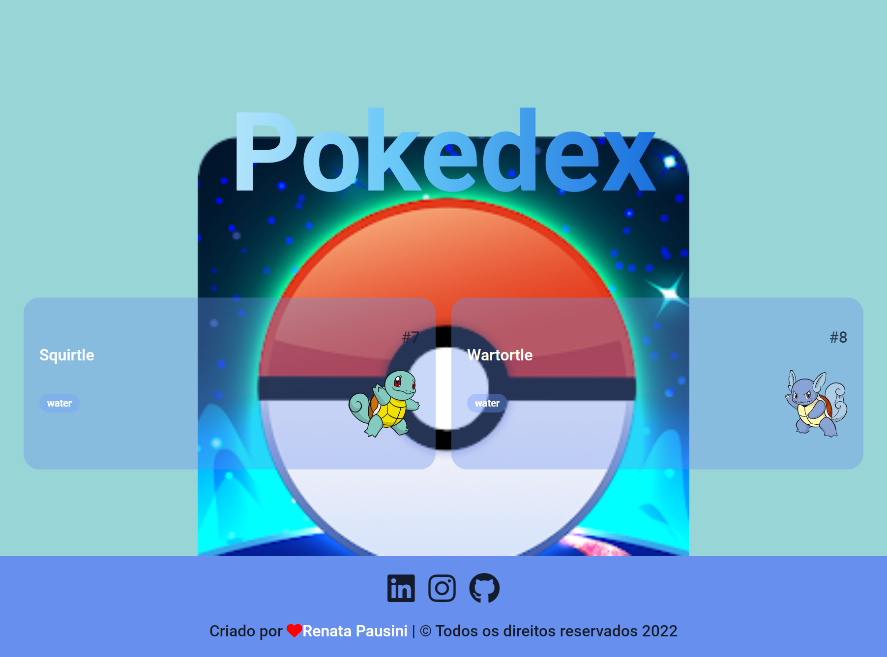

# Pokedex desafio responsivo

 
Página pokedex responsiva capturando 2 imagens de exemplo da api do pokemon.Desafio da NTT DATA - Dio.

## Instalação:

npm install http-server 

#### Sequência para criar o projeto

- Utilizado api pública do pokedex  
  _https://pokeapi.co/api/v2/pokemon?offset=5&limit=2_ 

## Pré-visualização: [pokedex](https://vercel.com/rpatricia/desafio-pokedex)

